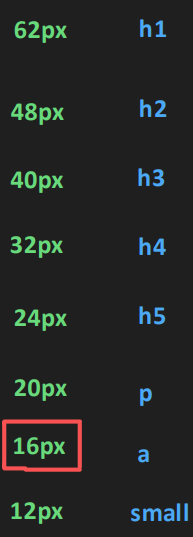

css - cascading style sheet
block inline
content
box-w,h,b,m,p
css -- html link -- inline ,internal, external
css units - px,em,rem
px standard values-- 8px,12px,16px,20px,24px,28px,32px,64px

small text -- 16px
larger text -- 32px 

tag,class, id

h1 {
  property:"value";
  property:"value";
  property:"value";
}
  1/96 inch -- 1px

html
  head
  body
    p.html-content 
      span.content
    p
    a.html-content
    a

font-weight
text-decoration
font-style
text-transform
list-style
line-height
letter-spacing
text-align block vs inline
font-size
font-family
color

px,em,rem
combinatr seectors ul>li
types --- >
descendant child selector div p
direct descendant child selector div>p
adjacent sibling selector h1+p
general sibling selector h1~p

------

pseudo class
pseudo element
grouping h1,h2
-link,visited,hover,active
first chuld,last child, 
inheritance

1/97 inch - 2px

rem

html{
  font-size
}

block,inline, block - inline
max,min width
overflow
percentage,vh,vw
responsive
variable :root
calc
position

box-1 -- 2  160px
box2 -3  240px
3 -1  80px
4 -1  100px

500/7 = 80

display - block,inline, inline-block, flex, grid

flex  -- row/column -- flex-wrap

grid -- row & colum

px,rem,em,%,vh,vw

display none vs visibility hidden
opacity
transform/transition
keyframes
background image
cursor

scale -
default -- 100px -1 - 0.5 -50px - 2 200px 2.5 250px
1.5 - x - 150px - width
2 - y - 50px - height

linear
ease
 ease-in -- slow -- fast
 ease-out -- fast -- slow
 ease-in-out -- slow -- fast-- slow
