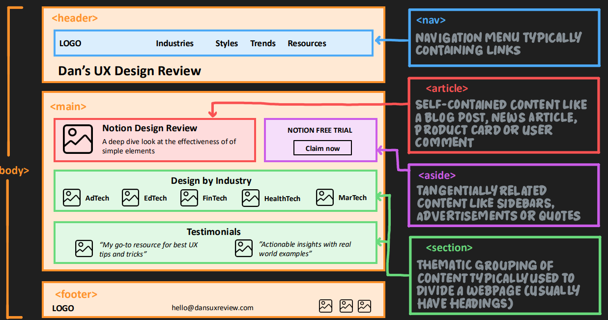

https://github.com/hemapriya372000-cell/html_course
//12/07/2026

HTML- Hyper Text Markup Language
Hyper text - linking between webpages - eg: a tag - internal/external
markup - marks tag 
language - it has its own rules,syntax
Html - foundational of webpage
To create webpage using html we need - browser(to view webpage) & code editor(to create webpage- vs code - install from google)
then create a file that ends with extension .html and start working
html tags- it wraps content and provides instruction to the browser
example : 
 This is a paragraph 

<tagname> - opening tag
This is a paragraph - content
</tagname> - closing tag
we store file with different extensions
eg: pdf --> .pdf
image --> .png,.jpeg,.jpg
document --> .txt,.docx
audio --> .mp3,.wav
video --> .mp4
likewise we save html file with .html extension
when creating htm file always use lowercase and multiple words are hypen/underscore seperated
nesting & indenting
short cut to comment html  -- ctrl + /
relative path vs absolute path
attribute - provide extra information about the page
id -html - help us link to specific section of page
css-help us style specific elememt
javascript- help us manipulate data
block vs inline 
inline inside block
block block, block inline,inline inline -- we can use
 inline block -- don't use
sup,sub

//7/15/2026

self closing tag - img,input,hr,br
alt - screenreaders,seo
svg
forms - input,textarea,select,
button
minlength,maxlength,min, max
checkbox, radio
semantic,non sematic tags
div- block level container to group content for styling and positioning
inline-used to style portion of container
semantic tags-accesbility,seo,cleaner code

table , colspan,rowspan
figure,figcaption
seo  search engine optimization

<a href="link">   content </a>

<h1 class="class-name">  content</h1>